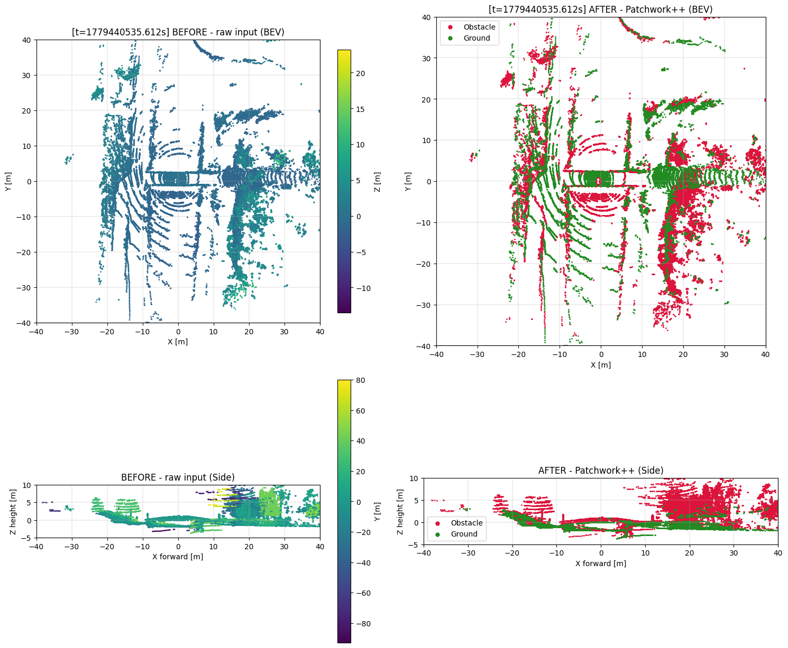
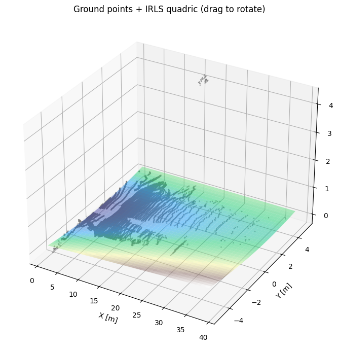
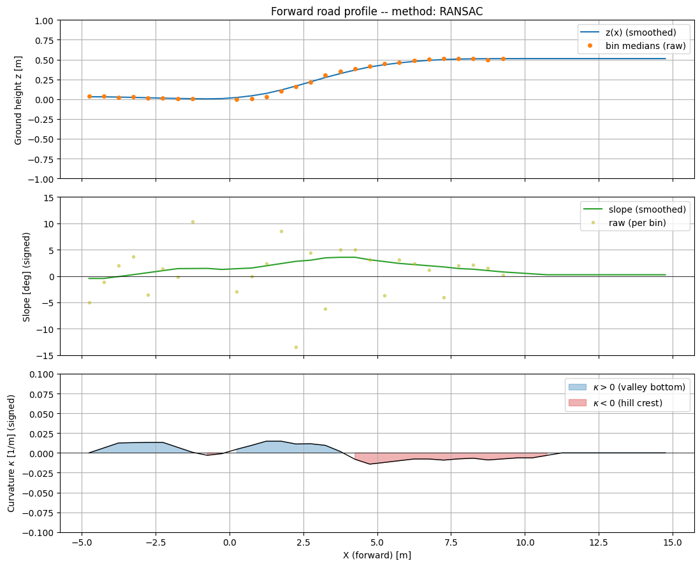

# Dutch Hills Dataset - Vertical-curvature Identification from Sensor-fused Telemetry and AHN (LiDAR, IMU, GPS, AHN)

A Sensor-fused Telemetry and AHN-based curvature detection/calculation pipeline that compares vertical curvature calculation methods and builds the foundation to classify/detect curvature in datasets.

This repository accompanies a Bachelor's End Thesis conducted at **Delft University of Technology**, Department of **Cognitive Robotics**.

---

## 📖 Overview

Traditional ground segmentation methods often assume a flat or near-flat ground plane, which fails on terrain with vertical curvature (hills, slopes, road crests, valleys, etc.). This project addresses that gap by:

- Building a LiDAR dataset that explicitly includes vertical curvature
- Applying filtering methods that identify curved ground accurately
- Providing reproducible scripts and notebooks for analysis and visualization of vertical curvature in 3D point clouds

## 📁 Repository Structure

```
Curvature Calculation/          # Calculation methods that quantify vertical curvature
Filtering Methods/              # Ground segmentation methods for surfaces with vertical curvature
Pictures                        # Pictures used in the READMEs
Pipeline                        # Scripts that automate the calculation and validation processes
Useful scripts                  # Useful scripts when working in this repository or pointclouds in general
Validation/                     # Scripts that validate the curvature calculation from "3. Curvature Calculation"
README.md
environment.yml
requirements.txt                # pip requirements
```


## ⚙️ Installation

**Requirements:** Python 3.9+ recommended.

Clone the repository:
```bash
git clone https://github.com/Karel317/lidar-ground-segmentation.git
cd lidar-ground-segmentation
```

Create a virtual environment (recommended):
```bash
python -m venv venv
source venv/bin/activate        # Linux/macOS
venv\Scripts\activate           # Windows
```

Install dependencies:
```bash
pip install -r requirements.txt
```

## 📂 Dataset

The dataset is produced with the help of the TUDelft SenseBike.


This dataset is **not included** in this repository or to be found online due to its size.

---

## 🚀 Usage

### Running the notebooks and python scripts
Launch Visual Studio Code and clone the repository there. 
Now run the desired files via VSCode.

---


## 📊 Results
The Validation Methods folder involves scripts that use physical measurements in order to provide a method to validate the vertical curvature calculation on the 3D pointclouds. Example output:


The Filtering Methods folder involves scripts that apply filtering methods to identify groundpoints on curved terrain accurately. Example output:


The Curvature Calculation folder involves scripts that apply methods to calculate curvature from 3D pointclouds. Example output:




---

## 🔬 Method
For the full methodology, see the thesis report: `https://www.overleaf.com/project/69b282b375350f2533f82419`.

---

## 👤 Authors

**Karel Peuskens, Jonas Repa, Rayan Ait Hadj Brahim, Lars Wissink, Leon Sinnesael** — Bachelor's End Thesis  
Department of Cognitive Robotics, Delft University of Technology

Supervisor: Dr. H. Caesar

---
