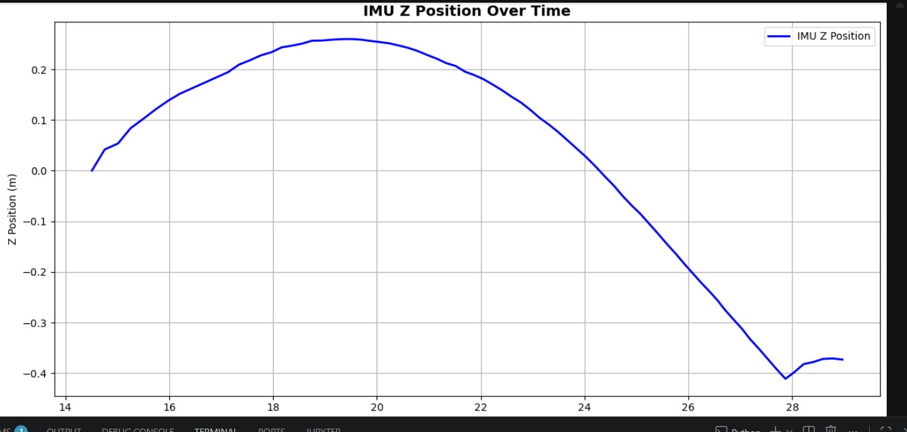

# Dutch Hills Dataset: Identifying vertical curvature using the SenseBike, a sensor equipped bicycle

A LiDAR-based curvature detection/calculation pipeline that builds a dataset with vertical curvature and identifies that curvature in 3D point clouds.

This repository accompanies a Bachelor's End Thesis conducted at **Delft University of Technology**, Department of **Cognitive Robotics**.

---

## 📖 Overview

Traditional ground segmentation methods often assume a flat or near-flat ground plane, which fails on terrain with vertical curvature (hills, slopes, road crests, valleys, etc.). This project addresses that gap by:

- Building a LiDAR dataset that explicitly includes vertical curvature
- Applying filtering methods that identify curved ground accurately
- Providing reproducible scripts and notebooks for analysis and visualization of vertical curvature in 3D point clouds

## 📁 Repository Structure

```
lidar-ground-segmentation/
├── 1. Validation/                  # Scripts that validate the curvature calculation from "3. Curvature Calculation"
├── 2. Filtering Methods/           # Ground segmentation methods
├── 3. Curvature Calculation/       # Calculation methods that identify and quantify vertical curvature
├── Pictures                        # Pictures used in the READMEs
├── Results                         # WHAT THE HELLY IS THIS
├── .gitattributes
├── .mcap_to_.bin.ipynb             # .mcap to .bin format converter
├── IMU SVO to MCAP.py              # .svo to .mcap format converter
├── README.md
├── environment.yml
└── requirements.txt                # pip requirements
```


## ⚙️ Installation

**Requirements:** Python 3.9+ recommended.

Clone the repository:
```bash
git clone https://github.com/Karel317/lidar-ground-segmentation.git
cd lidar-ground-segmentation
```

Create a virtual environment (recommended):
```bash
python -m venv venv
source venv/bin/activate        # Linux/macOS
venv\Scripts\activate           # Windows
```

Install dependencies:
```bash
pip install -r requirements.txt
```

## 📂 Dataset

The dataset is **not included** in this repository due to its size. Download it separately:

The data is stored on a hard drive and the SenseBike, which are in the hands of the TU Delft Department of Cognitive Robotics.

---

## 🚀 Usage

### Running the notebooks and python scripts
Launch Visual Studio Code and clone the repository there. 
Now run the desired files via VSCode.

---


## 📊 Results
The Validation Methods folder involves scripts that use the AHN Height map and several sensors in order to provide a method to validate the vertical curvature calculation on the 3D pointclouds. Example output:


The Filtering Methods folder involves scripts that apply filtering methods to identify groundpoints on curved terrain accurately. Example output:


The Curvature Calculation folder involves scripts that apply methods to calculate curvature on from 3D pointclouds. Example output:


---

## 🔬 Method
For the full methodology, see the thesis report: `https://www.overleaf.com/project/69b282b375350f2533f82419`.

---

## 👤 Authors

**Karel Peuskens, Jonas Repa, Rayan Ait Hadj Brahim, Lars Wissink, Leon Sinnesael** — Bachelor's End Thesis  
Department of Cognitive Robotics, Delft University of Technology

Supervisor: Dr. H. Caesar

---


# To do's for GitHub Cleanup

**Delete all unnessecary files**

**Make sure all seperate files are explained (usage/how it works)**

  Validation methods README
  
  Filtering methods README
  
  Curvature Calculation README
  
  Useful scripts README

  pipeline README

  
**Update this Overview README to explain the structure and purpose of the repository coherently**

**Update Requirements file**                                                                                                       (DONE)

**Don't forget to talk about installing ZED-SDK and CUDA!**


OPTIONAL: —
Add a Readme for Discussion topics (what can be improved/automised)

